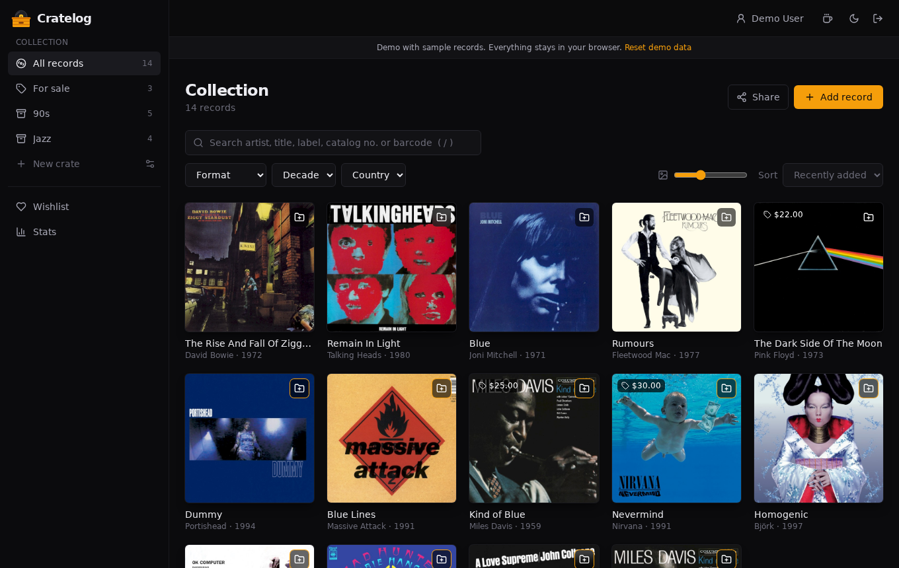
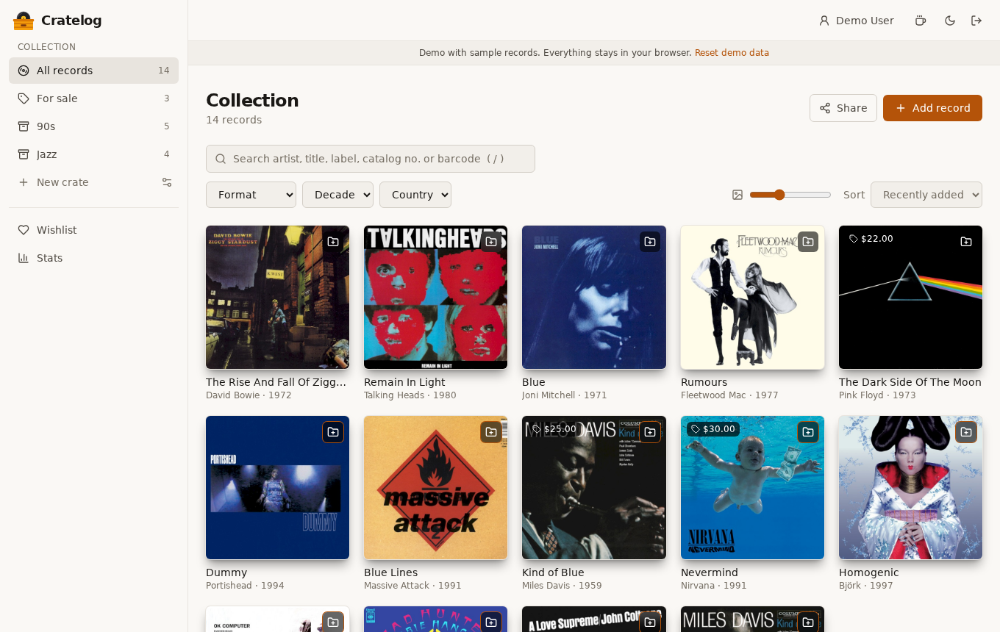
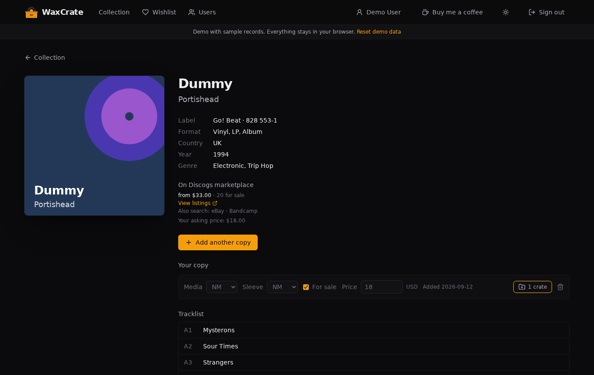
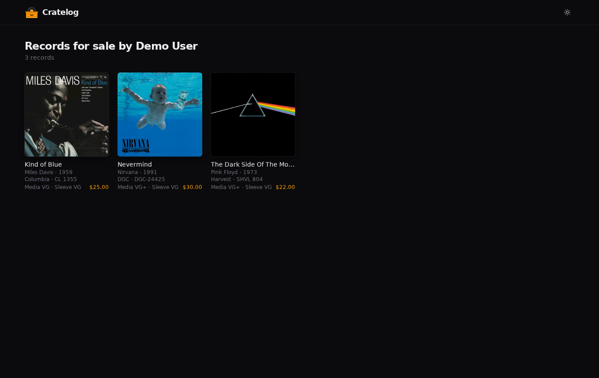

<p align="center">
  
</p>

<h1 align="center">WaxCrate</h1>

<p align="center">
  <strong>A self-hosted vinyl collection manager. Your database is the source of truth; Discogs is the metadata source.</strong>
</p>

<p align="center">
  <a href="https://blindpassasjer.github.io/waxcrate/"><strong>Live demo</strong></a> ·
  <a href="#quick-start-docker-compose">Quick start</a> ·
  <a href="#build-it-yourself">Build it yourself</a> ·
  <a href="#features">Features</a> ·
  <a href="#license">License</a>
</p>

<p align="center">
  <a href="LICENSE"></a>
  <a href="https://github.com/blindpassasjer/waxcrate/pkgs/container/waxcrate"></a>
  
  <a href="package.json"></a>
</p>

---

WaxCrate keeps track of the records you own, the ones you want, and the ones you're selling. Add a
record by searching Discogs (by name, catalog number or barcode) and WaxCrate stores the metadata
and cover in **your own SQLite database**, so your collection keeps working, and stays yours, even if
Discogs changes or goes away.

It runs on your own machine, NAS or VPS with one `docker compose up`. No subscriptions, no ads, no
third party holding your collection.

**[Try the live demo →](https://blindpassasjer.github.io/waxcrate/)** — a static build with sample
records and a mocked, browser-only backend (see [Demo mode](#demo-mode)), so you can click around
without installing anything.

## Screenshots

<p align="center">
  
  
</p>
<p align="center">
  
  
</p>

## Features

- 💿 **Add records from Discogs** — search by artist/album, catalog number or barcode; the exact
  pressing, tracklist, label and cover are saved locally
- 🗂️ **Every copy is its own entry** — own two copies of a record? Grade each one separately (media and
  sleeve, Goldmine scale) and add notes
- 📦 **Crates** — group records any way you like ("Jazz", "90s", "Listening room"); a copy can live in
  several
- 🔍 **Instant search and filters** — search artist, title, label, catalog number or barcode as you
  type (press `/` to jump to it), filter by format, decade and country, and sort
- ❤️ **Wishlist** — track the pressings you're after, see the current Discogs marketplace price and
  number of copies for sale, and move a record to your collection with one click ("Got it")
- 🏷️ **For sale** — mark any copy as for sale with an asking price, filter your collection by it, and
  share a public "records I'm selling" page with grades and prices
- 🔗 **Share links** — a public, read-only link for your whole library, a single crate, your wishlist or
  your for-sale list. Notes stay private, and you can revoke a link at any time
- 📊 **Excel export** — download your collection, a crate, the for-sale list or the wishlist as `.xlsx`
- 👥 **Multiple users** — the admin creates accounts; everyone gets their own private collection
- 💱 **Prices in your currency** and a light/dark theme that follows your system
- 🐳 **One container** — the API, the web app and an SQLite database, nothing else to run

## Quick start (Docker Compose)

You need [Docker](https://docs.docker.com/get-docker/) with the Compose plugin. The image is
published to GitHub Container Registry for `linux/amd64` and `linux/arm64`, so it runs on a regular
PC, a Raspberry Pi and most NAS boxes.

1. **Get the compose file and the example settings:**

   ```sh
   git clone https://github.com/blindpassasjer/waxcrate.git
   cd waxcrate
   cp .env.example .env
   ```

   Don't want to clone? You only need [docker-compose.yml](docker-compose.yml) and a `.env` file
   next to it.

2. **Edit `.env`:**
   - `ADMIN_EMAIL` and `ADMIN_PASSWORD` — your admin login (required)
   - `DISCOGS_TOKEN` — a personal access token from
     [discogs.com/settings/developers](https://www.discogs.com/settings/developers). It works without
     one, but Discogs then allows fewer requests per minute and withholds search thumbnails, so
     setting it is recommended
   - `COOKIE_SECURE=true` — only if you serve WaxCrate over HTTPS

3. **Start it:**

   ```sh
   docker compose up -d
   ```

4. **Open <http://localhost:6170>** (or `http://<your-server>:6170`) and sign in with the admin
   account from step 2.

That's it. The database is created and migrated automatically on first start.

- The admin account is created from `ADMIN_EMAIL` / `ADMIN_PASSWORD` on **every** start, and its password
  is re-synced from the environment, so changing the variable and restarting is how you reset it.
- There is no public sign-up. The admin creates accounts under **Users**.
- To use another port, change the left side of `'6170:6170'` under `ports:` in `docker-compose.yml`.
- If you use `env_file: .env`, do not put `DATA_DIR` or `PORT` in it, and keep `DATA_DIR: /data` under
  `environment:` so nothing can redirect the database outside the data folder.

### Upgrading

```sh
git pull                  # if you cloned the repo, to pick up compose file changes
docker compose pull
docker compose up -d
```

Database migrations run automatically when the container starts. Releases are tagged `X.Y.Z`; the
`latest` tag always points at the newest release, and you can pin a version in `docker-compose.yml`
(for example `ghcr.io/blindpassasjer/waxcrate:0.3.0`) if you prefer to upgrade deliberately.

### Where your data lives

Everything is stored in a plain folder next to your `docker-compose.yml`, not in an opaque Docker
volume, so you can browse, back up or move it like any other files:

| What | Where |
|---|---|
| Users, records, copies, crates, wishlist, share links (SQLite) | `./data/waxcrate.db` |
| Cover images fetched from Discogs | `./data/covers/` |

### Backups

Stop the container so the database isn't being written to, copy the folder, and start it again:

```sh
docker compose stop
cp -a data "data-backup-$(date +%F)"
docker compose start
```

To restore, stop the container, put the backed-up folder back as `./data`, and start it again.
Moving WaxCrate to a new machine is the same thing: copy `data/` over, along with your `.env`.

### Behind a reverse proxy / HTTPS

WaxCrate speaks plain HTTP on port 6170. To serve it over HTTPS, put a reverse proxy with a
certificate in front of it (Caddy, Traefik, Nginx Proxy Manager, or your NAS's built-in one all work)
and set `COOKIE_SECURE=true` in `.env` so the session cookie is only sent over HTTPS.

### Configuration

| Variable | Default | Description |
|---|---|---|
| `ADMIN_EMAIL` | — (required) | Email of the admin account, created on every start |
| `ADMIN_PASSWORD` | — (required) | Password of the admin account, re-synced on every start |
| `DISCOGS_TOKEN` | empty | Discogs personal access token; raises the rate limit and enables search thumbnails |
| `COOKIE_SECURE` | `false` | Set to `true` when served over HTTPS |
| `PORT` | `6170` | Port the server listens on. Preset in the Docker image, only set it for local runs |
| `DATA_DIR` | `./data` | Where the database and covers are stored. Preset to `/data` in the Docker image |
| `WEB_DIR` | `../web/dist` | Where the built web app is served from. Preset in the Docker image |

## Build it yourself

Pick whichever fits: build the Docker image from source, or run it directly with Node.js.

### Option A: Build the Docker image from source

Handy if you want to run a modified version or a commit that isn't released yet. You only need Docker
and Git.

```sh
git clone https://github.com/blindpassasjer/waxcrate.git
cd waxcrate
cp .env.example .env        # then set ADMIN_EMAIL and ADMIN_PASSWORD
docker compose up -d --build
```

`--build` makes Compose build the image from the [Dockerfile](Dockerfile) in this folder instead of
pulling the published one. To build the image on its own:

```sh
docker build -t waxcrate .
```

To build for another architecture (for example a Raspberry Pi from a PC), use
`docker buildx build --platform linux/arm64 -t waxcrate .`.

### Option B: Run it with Node.js (no Docker)

You need [Node.js](https://nodejs.org/) 20 or newer and npm.

```sh
git clone https://github.com/blindpassasjer/waxcrate.git
cd waxcrate
npm ci                      # install dependencies
npm run build               # builds the web app and the server

export ADMIN_EMAIL=admin@example.com
export ADMIN_PASSWORD=change-me-please
export DISCOGS_TOKEN=...    # optional, but recommended
npm start                   # http://localhost:6170
```

The server serves the built web app itself, so there is nothing else to run. Data is stored in
`apps/server/data/` unless you set `DATA_DIR` to somewhere else (use an absolute path). To keep it
running in the background, use a process manager such as systemd or pm2.

`better-sqlite3` is a native module. `npm ci` normally downloads a prebuilt binary; if there isn't one
for your platform it compiles from source, which needs a C/C++ toolchain (`build-essential` and
`python3` on Debian/Ubuntu).

## Demo mode

The [live demo](https://blindpassasjer.github.io/waxcrate/) is a static build deployed to GitHub
Pages by [`.github/workflows/deploy-demo.yml`](.github/workflows/deploy-demo.yml) on every push to
`main`. GitHub Pages can only serve static files, so the demo build replaces the real API client in
[`apps/web/src/api.ts`](apps/web/src/api.ts) with a mock
([`apps/web/src/demo/mockApi.ts`](apps/web/src/demo/mockApi.ts)) that runs entirely in your browser:

- A catalogue of sample records stands in for Discogs search. Covers are loaded from the [Cover Art Archive](https://coverartarchive.org/) when you're online, with generated artwork as the fallback, so no cover images are bundled.
- Your changes (adding records, grading copies, crates, for-sale prices, share links) are saved to
  `localStorage` on your own device. Nothing is sent to a server.
- Any email and password signs you in, and Excel export isn't available.
- **Reset demo data** in the banner at the top starts over.

Build it yourself with:

```sh
npm run build:demo          # output in apps/web/dist, served from /waxcrate/
```

or run it as a dev server (served from `/`) with `npm run dev:demo`. If you fork the repo, set
`VITE_DEMO_BASE` to your Pages subpath (for example `VITE_DEMO_BASE=/my-fork/`) and enable
**Settings → Pages → Source: GitHub Actions** on your fork.

If you change the shape of an API response, update the mock to match, or the demo will drift from
the real app.

## Development

```sh
npm install
export ADMIN_EMAIL=admin@example.com ADMIN_PASSWORD=change-me-please
npm run dev        # API on :6170, web on :5173 (proxies /api)
```

Open <http://localhost:5173>. Layout: `apps/server` (Hono + SQLite), `apps/web` (React + Vite +
Tailwind). `npm run typecheck` checks both. Database migrations live in
[`apps/server/src/db.ts`](apps/server/src/db.ts) and run on start.

## Tech stack

React 18 · Vite · Tailwind CSS 4 · Hono · SQLite (better-sqlite3) · Zod · TypeScript. One small
codebase, one container, no external services beyond the Discogs API.

## Support

WaxCrate is free and open source. If it's useful to you, you can [buy me a coffee](https://buymeacoffee.com/blindpassasjer) or [Vipps me](https://qr.vipps.no/box/d4cd2440-08dd-4eb9-b6b1-88130f984233/pay-in).

## Contributing

Issues and pull requests are welcome. The codebase is small enough that most changes are
straightforward to review.

## License

[Apache-2.0](LICENSE)
